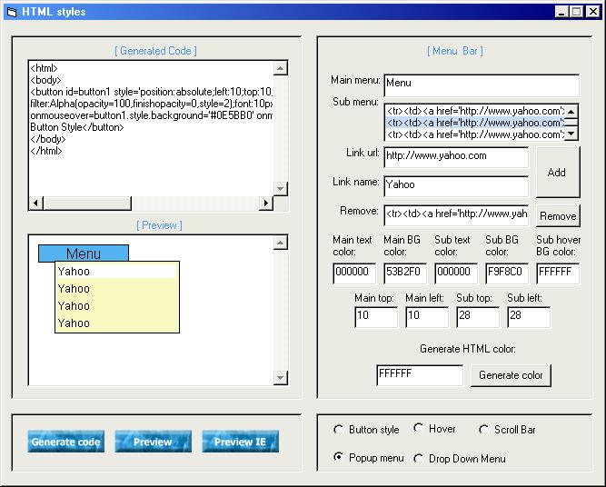



## HTML Style II

### Description

generate html syle code: popup menu, dropdown me,button,scroll bar...For internet explorer 4+. with some added interface, like putting image in a message box and editing message box button caption using API not a form. Please comment if you find some bugs. I just a young man, I'm not error free and not perfect.
 
### More Info
 

             |
---                |---
**Submitted On**   |2003-09-05 11:57:26
**By**             |[Marshall Greg R\. Poyaoan a\.k\.a "Pinoy Ako\!"](https://github.com/Planet-Source-Code/PSCIndex/blob/master/ByAuthor/marshall-greg-r-poyaoan-a-k-a-pinoy-ako.md)
**Level**          |Intermediate
**User Rating**    |5.0 (40 globes from 8 users)
**Compatibility**  |VB 6\.0
**Category**       |[Internet/ HTML](https://github.com/Planet-Source-Code/PSCIndex/blob/master/ByCategory/internet-html__1-34.md)
**World**          |[Visual Basic](https://github.com/Planet-Source-Code/PSCIndex/blob/master/ByWorld/visual-basic.md)
**Archive File**   |[HTML\_Style1644539122003\.zip](https://github.com/Planet-Source-Code/marshall-greg-r-poyaoan-a-k-a-pinoy-ako-html-style-ii__1-48164/archive/master.zip)

